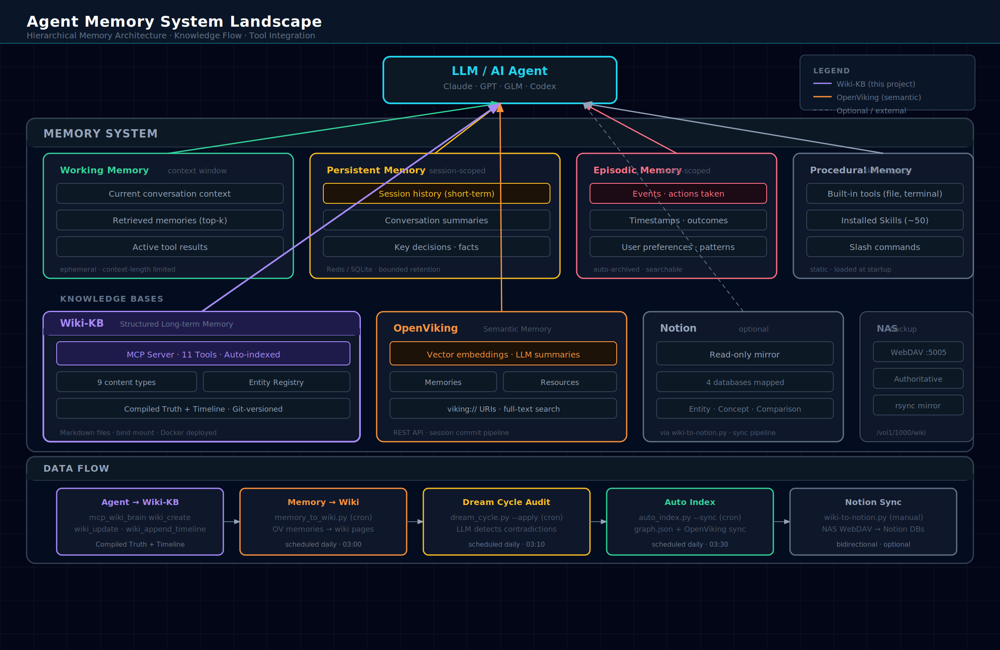
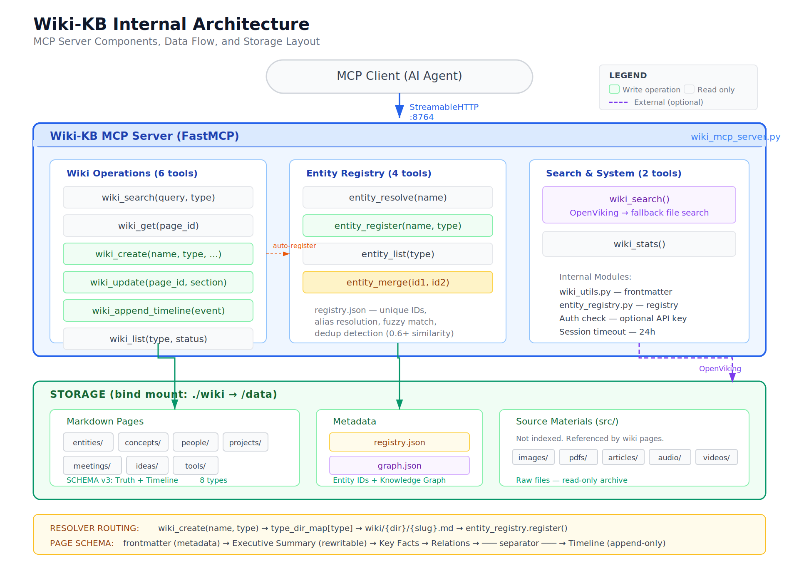

# Wiki Knowledge Base

[English](README.md) | [中文](README_zh.md)

> **Agent writes, human reads** — A structured knowledge base system that AI agents maintain autonomously.

Wiki KB is a structured knowledge base built on pure Markdown files, exposing operations via [MCP (Model Context Protocol)](https://modelcontextprotocol.io/) so that AI agents (Claude, GPT, GLM, etc.) can **actively read and write** knowledge during conversations.

## Why Wiki KB?

### The Problem

Existing AI knowledge management solutions all have significant limitations:

| Approach | Problem |
|----------|---------|
| **Notion / Confluence** | AI can only "read", never "write". All knowledge maintenance falls on humans. Data locked in proprietary platforms. |
| **Obsidian / Logseq** | Humans can edit, but AI cannot proactively write during conversations. Requires plugins/scripts to bridge. |
| **RAG (Vector DBs)** | Retrieval only — no knowledge accumulation. Knowledge is lost when a conversation ends. |
| **Dify / Coze / LangChain** | Tied to specific frameworks and LLMs. Knowledge structure dictated by tool's data model. |
| **AI writing to Notion/Obsidian** | No structured schema for knowledge. AI-generated content quality is inconsistent. No contradiction detection or source tracing. |

### Core Philosophy

**Agent writes, human reads.**

Most knowledge management systems assume humans are knowledge producers and AI is a consumer. Wiki KB inverts this — **AI agents are the day-to-day maintainers**, and humans only review and edit when needed.

This means:
- You mention a new project in conversation → Agent automatically creates a wiki page
- You correct a fact → Agent immediately updates the page + logs it in the Timeline
- A valuable decision emerges from discussion → Agent extracts and archives it automatically
- **You never manually "take notes"** — knowledge maintenance cost approaches zero

### Unique Design

**1. Compiled Truth + Timeline — Solving AI Hallucination**

Traditional knowledge bases only store "current conclusions" — AI-generated content has no traceable provenance. Every Wiki KB page has two layers:

- **Upper layer (Compiled Truth)**: Current best understanding. Both AI and humans can edit; freely rewritten at any time.
- **Lower layer (Timeline)**: Append-only evidence chain. Each entry is timestamped and sourced, never modified.

When the upper conclusion contradicts the lower evidence, **Timeline takes precedence**. This fundamentally solves the trustworthiness problem of AI-generated content — not through "better prompts", but through structural constraints.

**2. MCP Native — Zero Framework Lock-in**

Wiki KB is a standard MCP Server. Any MCP-compatible agent (Claude Desktop, Cursor, Hermes, OpenHands, etc.) can directly call its 13 tools. No SDK, no adapters, no agent code changes needed.

This means you can use Claude today, GPT tomorrow, an open-source model the day after — **your knowledge base stays, switching agents costs nothing**.

**3. Pure Markdown + Filesystem — Your Data, Always**

All knowledge lives as `.md` files. You can:
- Edit with any text editor
- Version control with Git
- Sync across machines with rsync/SCP
- Read, backup, and migrate offline

No database, no proprietary format, no platform lock-in. Even if the Wiki KB project stops being maintained, your knowledge remains fully usable.

**4. Automated Quality Assurance**

Knowledge is maintained by AI, but quality isn't left to chance:

- **Dream Cycle**: Periodic LLM audit of all pages — detects contradictions, outdated info, and knowledge gaps
- **Entity Registry**: Unified entity ID and alias management — prevents "the same thing going by three names"
- **Auto Index**: Automatic knowledge graph generation, maintains cross-references between entities

**5. Progressive Complexity**

You don't need everything at once:

- **Minimal deploy**: Just Docker — no OpenViking, no LLM API key needed. Wiki CRUD and file search work out of the box.
- **+ OpenViking**: Semantic search with natural language queries
- **+ LLM API Key**: Dream Cycle audit + Memory Sync automation

Each step is optional. Nothing blocks you from starting.

### Comparison with Alternatives

| Dimension | Wiki KB | Notion AI | Obsidian + AI | RAG Vector DB |
|-----------|---------|-----------|---------------|---------------|
| AI can proactively write | ✅ Core feature | ❌ Read only | ⚠️ Plugins needed | ❌ Retrieval only |
| Structured knowledge schema | ✅ Schema v3 | ✅ DB Schema | ❌ Freeform | ❌ Unstructured |
| Source tracing | ✅ Timeline | ❌ | ⚠️ Some plugins | ❌ |
| Data sovereignty | ✅ Pure Markdown | ❌ Platform lock-in | ✅ Pure Markdown | ⚠️ Implementation-dependent |
| Agent framework lock-in | ❌ MCP standard | ✅ Locked to Notion | ✅ Locked to Obsidian | ✅ Locked to framework |
| Automated quality audit | ✅ Dream Cycle | ❌ | ❌ | ❌ |
| Offline capable | ✅ Pure files | ❌ | ✅ | ⚠️ Depends on vector DB |
| Multi-agent compatible | ✅ Any MCP client | ❌ | ❌ | ⚠️ Framework-dependent |

## ✨ Features

- 📝 **Structured Schema** — "Compiled Truth + Timeline" dual-layer model: upper layer is rewritable, lower layer is append-only
- 🔌 **MCP Server** — Standard MCP protocol, any MCP-compatible agent can call directly
- 🔍 **Semantic Search** — Optional [OpenViking](https://github.com/openviking/openviking) integration for vector retrieval
- 🧠 **Entity Registry** — Built-in entity management with alias resolution, fuzzy matching, and deduplication
- 🤖 **Automation Pipeline** — Dream Cycle (LLM audit), Auto Index (knowledge graph), Memory Sync (conversation → Wiki)
- 🐳 **Docker Deployment** — Single container, low resource usage (512MB / 0.5 CPU)
- 📂 **Pure File Storage** — All data is Markdown files, editable with any editor, Git-friendly
- 🔒 **Content Hash Protection** — SHA256 hash detects manual edits, prevents silent agent overwrites
- 🔄 **Rejection Feedback Loop** — Review failures are stored and surfaced to agents on next attempt
- 🔧 **Git Safety Net** — Every write auto-commits, `wiki_undo` reverts, full change history via `wiki_log`

## Architecture Overview

### Position in Agent Memory Systems

Wiki-KB is the **structured long-term memory layer** in an agent memory system, working alongside Persistent Memory, OpenViking, and Skills:



**Data flow**:
1. Knowledge emerges in conversation → Agent calls `wiki_create` / `wiki_update` via MCP
2. Cron → `memory_to_wiki.py` extracts memories from OpenViking back to Wiki
3. Cron → `dream_cycle.py` runs LLM audit on Wiki quality
4. `auto_index.py` → syncs Wiki pages to OpenViking (semantic search)
5. Human → directly edits `.md` files at any time

### Internal Architecture



## Quick Start

### Prerequisites

- Docker & Docker Compose
- Python 3.11+ (for running scripts locally)

### 1. Clone & Configure

```bash
git clone https://github.com/SonicBotMan/wiki-kb.git
cd wiki-kb

# Create environment config
cp .env.example .env
# Edit .env with your settings (see Environment Variables below)
```

### 2. Create Wiki Directory Structure

```bash
mkdir -p wiki/{concepts,entities,people,projects,meetings,ideas,comparisons,queries,tools}
mkdir -p wiki/{logs/dream-reports,src/{articles,audio,images,pdfs,videos}}
mkdir -p scripts
```

### 3. Docker Deployment

```bash
docker compose up -d --build

# Wait for health check (≈30s)
docker ps --filter name=wiki-brain --format "{{.Status}}"
```

### 4. Verify MCP Endpoint

```bash
curl -s -X POST http://localhost:8764/mcp \
  -H "Content-Type: application/json" \
  -H "Accept: application/json, text/event-stream" \
  -d '{"jsonrpc":"2.0","id":1,"method":"initialize","params":{"protocolVersion":"2024-11-05","capabilities":{},"clientInfo":{"name":"test","version":"1.0"}}}'
```

## Directory Structure

```
wiki-kb/
├── scripts/                    # Core scripts (bind-mounted into container)
│   ├── wiki_mcp_server.py      # MCP Server (13 tools)
│   ├── wiki_config.py          # Centralized config module
│   ├── wiki_utils.py           # Shared utilities (frontmatter, relations)
│   ├── entity_registry.py      # Entity registry (CLI + API)
│   ├── auto_index.py           # Auto index + OpenViking sync
│   ├── dream_cycle.py          # LLM knowledge audit
│   ├── memory_to_wiki.py       # Conversation memory → Wiki sync
│   ├── wiki-to-notion.py       # Wiki → Notion sync
│   ├── migrate_wiki_schema.py  # v2 → v3 schema migration
│   └── wiki-backup.sh          # Backup script
├── wiki-kb-sync.sh             # One-command sync (container → GitHub)
├── wiki/                       # Knowledge base data (bind-mounted into container)
│   ├── concepts/               # Mental models, frameworks, technical concepts
│   ├── entities/               # Products, organizations, companies, platforms
│   ├── people/                 # People
│   ├── projects/               # Projects
│   ├── meetings/               # Meeting notes, decision records
│   ├── ideas/                  # Ideas, inspirations, directions to explore
│   ├── comparisons/            # Comparative analyses
│   ├── queries/                # Query records
│   ├── tools/                  # Tools and utilities
│   ├── src/                    # Raw materials (excluded from indexing)
│   │   ├── articles/           # Article archives
│   │   ├── images/             # Images
│   │   ├── pdfs/               # PDF documents
│   │   ├── audio/              # Audio files
│   │   └── videos/             # Videos
│   ├── logs/                   # Logs and audit reports
│   ├── SCHEMA.md               # Page structure specification
│   ├── RESOLVER.md             # Category routing rules
│   ├── graph.json              # Knowledge graph
│   ├── registry.json           # Entity registry
│   └── index.md                # Table of contents
├── Dockerfile
├── docker-compose.yml
├── docker-compose.production.yml
├── .env.example
├── requirements.txt
├── CHANGELOG.md
└── README.md
```

## MCP Tools

Wiki KB exposes 15 MCP tools:

### Wiki Operations (10)

| Tool | Description |
|------|-------------|
| `wiki_search` | Semantic search across wiki pages (supports type filtering) |
| `wiki_get` | Read full page content (returns structured sections + content_hash + rejection_history) |
| `wiki_create` | Create new page (auto-routes directory + registers entity + computes content hash) |
| `wiki_update` | Update specific section (detects manual edits via content hash) |
| `wiki_append_timeline` | Append Timeline entry (auto-formatted + date updated + hash check) |
| `wiki_list` | List pages (supports type / status filtering) |
| `wiki_health` | Health check (registry integrity, disk, OpenViking connectivity) |
| `wiki_review` | AI-assisted quality review (stores rejection feedback on failure) |
| `wiki_undo` | Revert last N `[wiki-brain]` git commits |
| `wiki_log` | Show recent `[wiki-brain]` git commit history |

### Entity Registry (4)

| Tool | Description |
|------|-------------|
| `entity_resolve` | Resolve entity by name or alias |
| `entity_register` | Register new entity |
| `entity_list` | List entities (supports type filtering) |
| `entity_merge` | Merge two entities |

### System (1)

| Tool | Description |
|------|-------------|
| `wiki_stats` | Returns statistics + OpenViking connectivity status |

> **Total**: 15 tools (10 Wiki + 4 Entity + 1 System)

### Usage in Agents

Add to your MCP client configuration:

```json
{
  "mcpServers": {
    "wiki-kb": {
      "url": "http://localhost:8764/mcp",
      "timeout": 60
    }
  }
}
```

**Claude Desktop** (`claude_desktop_config.json`):
```json
{
  "mcpServers": {
    "wiki-kb": {
      "url": "http://localhost:8764/mcp"
    }
  }
}
```

**Cursor / VS Code** (settings.json):
```json
{
  "mcp.servers": {
    "wiki-kb": {
      "url": "http://localhost:8764/mcp"
    }
  }
}
```

## Page Format (SCHEMA v3)

Every wiki page follows the **Compiled Truth + Timeline** pattern:

```markdown
---
title: Entity Name
created: 2026-01-15
updated: 2026-04-13
type: entity
tags: [ai-product, agent]
sources: [src/articles/xxx.md]
status: active
---

# Entity Name

## Executive Summary
Current best understanding. Rewritten as a whole when new information arrives — never appended.

## Key Facts
- Fact 1 (structured, directly referenceable by agents)
- Fact 2

## Relations
| Relation | Target | Description |
|----------|--------|-------------|
| uses | [[openviking]] | Semantic search backend |
| related | [[hermes-agent]] | Integration |

---

## Timeline

- **2026-01-15** | Page created
  [Source: wiki_mcp_server]
- **2026-03-20** | New version released
  [Source: Official blog, 2026-03-20]
```

### Core Rules

| Zone | Operation | Description |
|------|-----------|-------------|
| Frontmatter | **REWRITE** | Structured metadata |
| Executive Summary | **REWRITE** | Current best understanding, rewritten as a whole |
| Key Facts | **REWRITE** | Structured fact list |
| Relations | **REWRITE** | Relationship table |
| `---` (separator) | **FIXED** | Must not be removed |
| Timeline | **APPEND-ONLY** | Strictly append-only, never modify |

### Page Types

| type | Directory | Description |
|------|-----------|-------------|
| `person` | `people/` | People |
| `project` | `projects/` | Projects (with clear goals and timelines) |
| `entity` | `entities/` | Products / organizations / companies / platforms |
| `concept` | `concepts/` | Mental models / frameworks / technical concepts |
| `meeting` | `meetings/` | Meeting notes / decision records |
| `idea` | `ideas/` | Ideas / inspirations / directions to explore |
| `comparison` | `comparisons/` | Comparative analyses |
| `query` | `queries/` | Query records |
| `tool` | `tools/` | Tools and utilities |

### Relation Types

| Relation | Meaning |
|----------|---------|
| `uses` | Uses / depends on |
| `part-of` | Belongs to / subset of |
| `related` | Related to |
| `contrasts` | Contrasts / competes with |
| `implements` | Implements / deploys |
| `created-by` | Created by |
| `evolved-from` | Evolved from |

### Status Lifecycle

`draft` → `active` → `archived`

- Pages auto-created by agents are marked `draft`
- Dream Cycle promotes them to `active` after review
- Pages are archived when content is fully superseded

## Automation Pipeline

### Dream Cycle — LLM Knowledge Audit

Periodically audits knowledge base quality using LLM, detecting:
- **Contradictions** — Cross-page information conflicts
- **Outdated info** — Information no longer accurate
- **Gaps** — Missing important knowledge
- **Relation issues** — Inconsistent entity relationships

```bash
# Manual audit (dry-run)
docker exec wiki-brain python3 /app/scripts/dream_cycle.py

# Apply audit suggestions
docker exec wiki-brain python3 /app/scripts/dream_cycle.py --apply
```

### Auto Index — Knowledge Graph Generation

Detects file changes, auto-generates `graph.json` (nodes + edges), optionally syncs to OpenViking.

```bash
docker exec wiki-brain python3 /app/scripts/auto_index.py
```

### Memory to Wiki — Conversation Memory Sync

Extracts entities and events from OpenViking memories, writes them back to Wiki pages.

```bash
docker exec wiki-brain python3 /app/scripts/memory_to_wiki.py
```

### Cron Schedule

```bash
# Daily 03:00 — Conversation memory sync
0 3 * * * docker exec wiki-brain python3 /app/scripts/memory_to_wiki.py >> /path/to/wiki/logs/cron.log 2>&1

# Daily 03:10 — Dream Cycle audit
10 3 * * * docker exec wiki-brain python3 /app/scripts/dream_cycle.py --apply >> /path/to/wiki/logs/cron.log 2>&1

# Daily 03:30 — Auto index + OpenViking sync
30 3 * * * docker exec wiki-brain python3 /app/scripts/auto_index.py --sync >> /path/to/wiki/logs/cron.log 2>&1

# Daily 04:00 — Backup
0 4 * * * /path/to/wiki-kb/scripts/wiki-backup.sh >> /path/to/wiki/logs/backup.log 2>&1
```

## Environment Variables

| Variable | Required | Default | Description |
|----------|----------|---------|-------------|
| `WIKI_ROOT` | No | `/data` | Wiki data root directory (inside container) |
| `MCP_PORT` | No | `8764` | MCP Server port |
| `OPENVIKING_ENDPOINT` | No | `http://localhost:1933` | OpenViking full URL |
| `OPENVIKING_API_KEY` | No | — | OpenViking API Key (skip OV integration if unset) |
| `OPENVIKING_ACCOUNT` | No | `hermes` | OpenViking account name |
| `OPENVIKING_USER` | No | `default` | OpenViking user name |
| `MCP_API_KEY` | No | — | MCP API Key (skip auth if unset) |
| `GLM_API_KEY` | Dream Cycle | — | LLM API Key (Dream Cycle / Memory Sync) |
| `GLM_BASE_URL` | Dream Cycle | — | LLM API Base URL |
| `DREAM_CYCLE_MODEL` | Dream Cycle | `glm-4-flash` | LLM model for Dream Cycle |
| `MEMORY_TO_WIKI_MODEL` | Memory Sync | `glm-4-flash` | LLM model for Memory Sync |
| `NOTION_API_KEY` | Notion Sync | — | Notion API Key (skip Notion sync if unset) |
| `NOTION_DB_ENTITY` | Notion Sync | — | Notion Entity database ID |
| `NOTION_DB_CONCEPT` | Notion Sync | — | Notion Concept database ID |
| `NOTION_DB_TOOL` | Notion Sync | — | Notion Tool database ID |
| `NOTION_DB_PROJECT` | Notion Sync | — | Notion Project database ID |

### .env.example

```env
# === MCP Server ===
MCP_PORT=8764
# MCP_API_KEY=***    # Leave unset to skip auth (recommended for LAN)

# === OpenViking (optional) ===
# OPENVIKING_ENDPOINT=http://localhost:1933
# OPENVIKING_API_KEY=***
# OPENVIKING_ACCOUNT=hermes
# OPENVIKING_USER=default

# === LLM (required for Dream Cycle + Memory Sync) ===
# GLM_API_KEY=***
# GLM_BASE_URL=https://open.bigmodel.cn/api/paas/v4
# DREAM_CYCLE_MODEL=glm-4-flash
# MEMORY_TO_WIKI_MODEL=glm-4-flash

# === Notion (optional) ===
# NOTION_API_KEY=***
# NOTION_DB_ENTITY=ntn_xxxxxxxx
# NOTION_DB_CONCEPT=ntn_xxxxxxxx
# NOTION_DB_TOOL=ntn_xxxxxxxx
# NOTION_DB_PROJECT=ntn_xxxxxxxx
```

## Docker Compose Configuration

```yaml
services:
  wiki-brain:
    build: .
    container_name: wiki-brain
    restart: unless-stopped
    ports:
      - "0.0.0.0:8764:8764"
    volumes:
      - ./wiki:/data                    # Wiki data
      - ./scripts:/app/scripts           # Scripts (hot-reload, no rebuild needed)
      - ./.env:/app/.env:ro             # Environment variables
    env_file:
      - .env
    environment:
      - PYTHONPATH=/app/scripts
      - PYTHONUNBUFFERED=1
    deploy:
      resources:
        limits:
          memory: 512M
          cpus: "0.5"
    logging:
      driver: json-file
      options:
        max-size: "10m"
        max-file: "3"
```

**Combined deployment with OpenViking** (optional):

```yaml
services:
  wiki-brain:
    build: .
    container_name: wiki-brain
    restart: unless-stopped
    ports:
      - "0.0.0.0:8764:8764"
    volumes:
      - ./wiki:/data
      - ./scripts:/app/scripts
      - ./.env:/app/.env:ro
    env_file:
      - .env
    environment:
      - PYTHONPATH=/app/scripts
      - PYTHONUNBUFFERED=1
    networks:
      - wiki-net

  openviking:
    image: openviking/openviking:latest
    container_name: openviking
    restart: unless-stopped
    ports:
      - "0.0.0.0:1933:1933"
    volumes:
      - ./openviking-data:/data
    networks:
      - wiki-net

networks:
  wiki-net:
    driver: bridge
```

## Entity Registry

Built-in entity management system with unique IDs + alias index:

```json
{
  "entities": {
    "ent_a1b2c3": {
      "id": "ent_a1b2c3",
      "canonical_name": "OpenViking",
      "aliases": ["openviking", "ov", "viking"],
      "type": "entity",
      "primary_page": "entities/openviking.md",
      "created": "2026-01-15",
      "updated": "2026-04-13"
    }
  },
  "alias_index": {
    "openviking": "ent_a1b2c3",
    "ov": "ent_a1b2c3"
  },
  "stats": {
    "total_entities": 18,
    "total_aliases": 42
  }
}
```

### CLI Commands

```bash
# Scan all wiki pages, auto-register unregistered entities
docker exec wiki-brain python3 -m entity_registry scan

# List all entities
docker exec wiki-brain python3 -m entity_registry list

# Search entities
docker exec wiki-brain python3 -m entity_registry search "openviking"

# Detect duplicate entities
docker exec wiki-brain python3 -m entity_registry dedup

# Merge entities
docker exec wiki-brain python3 -m entity_registry merge ent_a1b2c3 ent_d4e5f6

# Rebuild index
docker exec wiki-brain python3 -m entity_registry rebuild
```

## Search

### File Search (Default)

When OpenViking is unavailable, automatically falls back to local file search (substring matching).

### OpenViking Semantic Search (Optional)

With OpenViking configured, `wiki_search` uses vector semantic search:

1. `auto_index.py --sync` syncs wiki pages to OpenViking
2. OpenViking auto-extracts semantics + vectorizes
3. `wiki_search` calls OpenViking API to return semantically relevant results

## Backup

```bash
# Manual backup
docker exec wiki-brain bash /app/scripts/wiki-backup.sh

# Keep last 3 backups
docker exec wiki-brain bash /app/scripts/wiki-backup.sh --keep 3
```

Backup excludes `logs/`, `__pycache__/`, `.git/`, `src/agency-agents/` and other large directories.

## Minimal Deployment (No OpenViking)

If you don't need semantic search, you can deploy just the Wiki KB MCP Server:

```yaml
# docker-compose.minimal.yml
services:
  wiki-brain:
    build: .
    container_name: wiki-brain
    restart: unless-stopped
    ports:
      - "0.0.0.0:8764:8764"
    volumes:
      - ./wiki:/data
      - ./.env:/app/.env:ro
    env_file:
      - .env
    deploy:
      resources:
        limits:
          memory: 256M
          cpus: "0.25"
```

Corresponding `.env`:
```env
MCP_PORT=8764
# Don't set OPENVIKING_* vars — search auto-falls back to file search
# Don't set GLM_* vars — Dream Cycle unavailable but Wiki CRUD works fine
```

## Container → GitHub Sync

The `wiki-kb-sync.sh` script keeps GitHub in sync with the production Docker container.

### Principle
> **Container is production truth. GitHub is downstream.** Never edit container scripts via GitHub PRs.

### Modes

```bash
# Check drift only (no changes pushed)
./wiki-kb-sync.sh --check

# Full sync: detect drift → sensitive scan → bilingual check → commit & push
./wiki-kb-sync.sh

# List files that would be synced
./wiki-kb-sync.sh --files

# Generate changelog entry from drift
./wiki-kb-sync.sh --changelog
```

### Exit Codes
| Code | Meaning |
|------|---------|
| 0 | Success (no drift, or synced) |
| 1 | Drift detected (in `--check` mode) |
| 2 | Sensitive information found (abort) |
| 3 | Git push failed |
| 4 | Missing prerequisites |

### Safe Drift Handling
Some differences between container and GitHub are expected and benign:
- **Notion UUID defaults**: Container uses real UUIDs as fallbacks; GitHub uses empty strings for security
- These are automatically detected and ignored (stripped before comparison)

## Development

### Running Locally (Without Docker)

```bash
cd wiki-kb

# Install dependencies
pip install -r requirements.txt

# Set environment variables
export WIKI_ROOT=./wiki
export MCP_PORT=8764

# Start MCP Server
python scripts/wiki_mcp_server.py
```

### Adding New Scripts

1. Create a new script in `scripts/`
2. Use `wiki_config.py`'s `load_config()` to read config (or `WIKI_ROOT` env var directly)
3. If importing `entity_registry`, add `sys.path.insert(0, str(Path(__file__).parent))` before import
4. Scripts take effect via bind mount — **no image rebuild needed**

### Modifying MCP Server

Edit `scripts/wiki_mcp_server.py`, then:

```bash
# scripts/ is bind-mounted, just restart the container
docker compose restart
```

## FAQ

### Session Terminated Error

MCP StreamableHTTP uses stateful sessions. Sessions may expire after long idle periods.

**Built-in fix**: `wiki_mcp_server.py` monkey-patches `session_idle_timeout` to 24 hours via `StreamableHTTPSessionManager`.

If issues persist, the client should implement auto-reconnect logic.

### API Key Auth Not Working

Under FastMCP StreamableHTTP mode, the `HTTP_AUTHORIZATION` environment variable may not be correctly set.

**Solutions**:
1. LAN environment: Leave `MCP_API_KEY` empty (skip auth)
2. Auth required: Add `headers: { Authorization: "Bearer <key>" }` in client config

### Port Binding Issues

If Wiki KB and the client are on different machines, ensure the port binds to `0.0.0.0` instead of `127.0.0.1`.

### OpenViking Sync Fails

`auto_index.py --sync` uses a two-step API:
1. `POST /api/v1/resources/temp_upload` — upload file
2. `POST /api/v1/resources` — add to OpenViking

Ensure `OPENVIKING_API_KEY`, `OPENVIKING_ACCOUNT`, and `OPENVIKING_USER` are configured correctly.

### How to Undo a Mistaken Wiki Change

Every write operation (create/update/timeline) is automatically committed to Git with a `[wiki-brain]` prefix.

```python
# Revert last change
wiki_undo(n=1)

# View change history
wiki_log(limit=10)
```

The Git repo is initialized automatically on first startup in `WIKI_ROOT`. Only `[wiki-brain]` prefixed commits are affected by `wiki_undo` — user's own commits are safe.

### Content Hash Warning

If `wiki_update` returns a `hash_warning`, it means the page was manually edited since the last agent write. The agent can decide whether to proceed or preserve the manual changes.

## License

MIT
